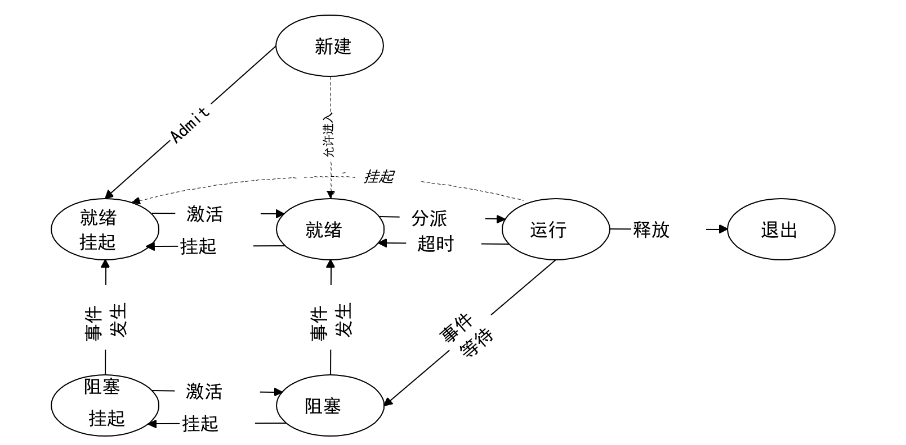

# Lab0实验报告
### 一.实验内容：
**练习1: 使用GDB验证启动流程**
为了熟悉使用qemu和gdb进行调试工作,使用gdb调试QEMU模拟的RISC-V计算机加电开始运行到执行应用程序的第一条指令（即跳转到0x80200000）这个阶段的执行过程，说明RISC-V硬件加电后的几条指令在哪里？完成了哪些功能？要求在报告中简要写出练习过程和回答。

### 二.实验流程
首先，我们在lab0文件夹下，先输入：
> make qemu

检查代码是否能够正常执行，按照预期，终端会输出(THU.CST) os is loading ...，之后进入死循环，具体的执行情况如下：

如图所示，此时加电后的计算机运行后的结果与我们预期的执行流，证明我们的环境与代码没有问题。

接下来，我们开始正式的探究。首先，在同样的文件夹下打开终端，输入
> make debug

接着，再打开另外一个终端，输入

> make gdb

即可使用gdb进行调试工作

我们先输入`x/10i $pc`查看即将执行的10条指令，结果如下：

说明在计算机上电后，并没有直接从0x80000000开始执行。这里要先介绍复位向量的概念，当处理器上电时，PC通常会被设定为一个特定地址，该地址就是复位向量。很明显，现在复位向量的值就应该是0x1000，因此处理器开始执行地址为0x1000。

接下来分析一下从0x1000到0x1010的五条指令的作用：

>0x1000: auipc t0,0x0

这句指令的功能是将当前PC的高20位，加上一个立即数（0x0），将结果赋给t0（赋值后为0x1000）。这句指令为后续指令的执行提供源操作数和基地址。

>0x1004: addi a1,t0,32

这句指令的功能是将寄存器t0的值（0x1000）加上一个立即数（32 = 0x20），并将结果赋给寄存器a1（赋值后为0x1020）。

>0x1008：csrr a0,mhartid

这句指令的功能是读取CSR（控制和状态寄存器）一个特定寄存器mhartid的值（通常存储当前硬件线程的唯一标识符）并存入寄存器a0，此时a0将包含当前hart（硬件线程）的ID。

>0x100c: ld t0,24(t0)

这句指令是从地址（t0 + 24）处读出相应的数值，并将其存放于t0。

>0x1010: jr t0

这句指令的功能为无条件跳转至t0中的地址，pc中的值也将被更新为t0的值，并继续从新的地址执行指令。

在执行完这段指令后PC就跳转至0x80000000处，因此在0x1010处t0的值应为0x80000000，那么0x100c处的ld指令应该就起到了将0x80000000存在寄存器t0的作用。我们可以输入以下指令来验证猜想：

~~~
break *0x1010
continue
info r t0
~~~

这五行代码即为复位代码，它主要是将计算机系统的各个组件（包括处理器、内存、设备等）置于初始状态，并且会启动Bootloader。

通过这段代码，PC跳转至0x80000000处，接下来输入
~~~
delete
si
~~~

让指令继续执行，在QEMU模拟的riscv计算机里，我们将使用QEMU自带的bootloader: OpenSBI固件，那么在 Qemu 开始执行任何指令之前，首先两个文件将被加载到 Qemu 的物理内存中：即作为 bootloader 的 OpenSBI.bin 被加载到物理内存以物理地址 0x80000000 开头的区域上，同时内核镜像 os.bin 被加载到以物理地址 0x80200000 开头的区域上。

输入
~~~
break *0x80000000
continue
x/10i $pc
si
~~~

查看结果

发现没有输出，证明了OpenSBI.bin的功能。作为Bootloader，它的功能可以分为两部分-Boot（开机）与Loader（将OS加载进入内存），在相应程序执行完毕后才会将执行控制权转交给加载的操作系统或应用程序，通常通过跳转到内核入口点，即0x80200000。由于篇幅有限，这里不再赘述Bootloader的详细工作原理。

接着输入
~~~
break *0x80200000
continue
~~~

查看结果

得到上述输出说明Bootloader已经加载了内核镜像并转交了控制权，输入
>x/10i $pc

可以发现此时PC已经跳转至0x80200000，接下来接着输入
>si

此时输出7  la sp, bootstacktop，这是entry.S的第一行汇编代码，为后续的内存管理做准备，也证明我们已经进入了内核，下一条指令为9 tail kern_init，即进入真正的入口init.c文件。该文件主要实现了输出字符串(THU.CST) os is loading ...的功能。

由于接下来就是进入init.c中，执行调用函数的代码，因此我们这里就不再赘述。输入
>continue

可以发现在打开输入make debug的窗口弹出了

我们希望看到的字符串并进入了无限循环，说明执行了kern_init，操作系统也成功启动。

### 三.实验涉及的重要知识点
**1.复位向量和复位代码**
复位向量指的是CPU在上电的时候，或者按下复位键的时候，PC被赋的初始值。这个值的选择会因为厂商的不同而发生变化，例如，80386的复位地址是0xFFF0（因为复位时是16位模式，写成32位时也作0xFFFFFFF0），MIPS的复位地址是0x00000000。在QEMU模拟的这款riscv处理器中，将复位向量地址初始化为0x1000，再将PC初始化为该复位地址，因此处理器将从此处开始执行复位代码，复位代码主要是将计算机系统的各个组件（包括处理器、内存、设备等）置于初始状态，并且会启动Bootloader，在这里QEMU的复位代码指定加载Bootloader的位置为0x80000000，Bootloader将加载操作系统内核并启动操作系统的执行。

**2.Bootloader**
Bootloader即引导加载程序，它的功能主要分为两部分，即Boot（启动）和Loader（加载）。作为一个小型程序，它一般存储在非易失性存储器，主要功能包括初始化系统硬件、将操作系统内核加载进入内存、允许用户选择不同的操作系统或内核参数、并最终将控制权转交给OS。

**3.内存布局**
一般来说，一个程序按照功能不同会分为下面这些段：

.text 段，即代码段，存放汇编代码； .rodata 段，即只读数据段，顾名思义里面存放只读数据，通常是程序中的常量； .data 段，存放被初始化的可读写数据，通常保存程序中的全局变量； .bss 段，存放被初始化为 00 的可读写数据，与 .data 段的不同之处在于我们知道它要被初始化为 00 ，因此在可执行文件中只需记录这个段的大小以及所在位置即可，而不用记录里面的数据。 stack ，即栈，用来存储程序运行过程中的局部变量，以及负责函数调用时的各种机制。它从高地址向低地址增长； heap ，即堆，用来支持程序运行过程中内存的动态分配，比如说你要读进来一个字符串，在你写程序的时候你也不知道它的长度究竟为多少，于是你只能在运行过程中，知道了字符串的长度之后，再在堆中给这个字符串分配内存。 内存布局，也就是指这些段各自所放的位置。一种典型的内存布局如下：

**4.I/O系统**
I/O系统负责管理计算机与外部设备之间的数据传输，包括输入和输出操作。它的主要功能包括通过设备驱动程序与硬件设备进行交互，确保操作系统可以识别和控制各种设备、使用缓冲区来临时存储数据，平衡设备与CPU之间的速度差异、调度多个I/O请求，确保高效利用设备资源以及提供统一的接口，使应用程序能够以简单的方式进行I/O操作。

### 四.OS原理中很重要，但在实验中没有对应上的知识点

**1.进程与线程**
进程是正在执行的程序的实例，包含代码段、数据段和控制段。而线程是进程内的一个执行单元，多个线程共享同一进程的资源。相比于进程，线程轻量级，创建和切换成本较低，适合并发操作。因此，线程是操作系统调度的最小单元，而进程是操作系统分配资源的最小单元。

**2.文件管理系统**
操作系统中的文件管理系统负责管理文件的创建、读取、写入和删除，同时还提供分层结构来组织文件，便于用户查找和管理，此外也有控制用户对文件和目录的访问权限，确保数据安全的功能。

# Lab1实验报告
### 一.实验内容
**练习1：理解内核启动中的程序入口操作**
阅读 kern/init/entry.S内容代码，结合操作系统内核启动流程，说明指令 la sp, bootstacktop 完成了什么操作，目的是什么？ tail kern_init 完成了什么操作，目的是什么？

**练习2：完善中断处理 （需要编程）**
请编程完善trap.c中的中断处理函数trap，在对时钟中断进行处理的部分填写kern/trap/trap.c函数中处理时钟中断的部分，使操作系统每遇到100次时钟中断后，调用print_ticks子程序，向屏幕上打印一行文字”100 ticks”，在打印完10行后调用sbi.h中的shut_down()函数关机。

要求完成问题1提出的相关函数实现，提交改进后的源代码包（可以编译执行），并在实验报告中简要说明实现过程和定时器中断中断处理的流程。实现要求的部分代码后，运行整个系统，大约每1秒会输出一次”100 ticks”，输出10行。

**扩展练习 Challenge1：描述与理解中断流程**
回答：描述ucore中处理中断异常的流程（从异常的产生开始），其中mov a0，sp的目的是什么？SAVE_ALL中寄寄存器保存在栈中的位置是什么确定的？对于任何中断，__alltraps 中都需要保存所有寄存器吗？请说明理由。

**扩展练习 Challenge2：理解上下文切换机制**
回答：在trapentry.S中汇编代码 csrw sscratch, sp；csrrw s0, sscratch, x0实现了什么操作，目的是什么？save all里面保存了stval scause这些csr，而在restore all里面却不还原它们？那这样store的意义何在呢？

**扩展练习Challenge3：完善异常中断**
编程完善在触发一条非法指令异常 mret和，在 kern/trap/trap.c的异常处理函数中捕获，并对其进行处理，简单输出异常类型和异常指令触发地址，即“Illegal instruction caught at 0x(地址)”，“ebreak caught at 0x（地址）”与“Exception type:Illegal instruction"，“Exception type: breakpoint”。

### 二.练习1实验流程
kern/init/entry.S这段代码是操作系统启动时进行的初始化，进行了设置了内核的入口点、初始化了栈指针和定义了内核栈的空间和栈顶。
la sp, bootstacktop：将栈顶bootstacktop加载到栈指针sp。这条指令在将控制权从Bootloader转移到内核时使用。在这个转移过程中，需要确保CPU的栈指针指向内核定义的内存区域，这样内核就可以完全控制启动栈。这是为了支持后续的用户进程并发运行和满足隔离等性质，内核需要从物理地址空间转移到虚拟地址空间做准备。

tail kern_init：这是一条尾调用指令，直接跳转到 kern_init 函数，而不需要通过正常的函数调用过程。tail是一条伪指令，被解释为：auipc x6, offset[32:12]，jalr x0, x6, offset[11:0]。如果使用普通的跳转指令（如 jal 或 jalr），则会创建一个新的栈帧，并将返回地址保存在栈上。这样，如果 kern_init 函数执行完毕并返回，它将返回到 kern_entry 中的跳转指令之后的地址。使用 tail 指令的目的是为了告诉编译器，kern_entry函数在执行完 tail 指令后不再需要返回。因此，没有必要保留返回地址和当前函数的栈帧。kern_init 函数负责初始化内核，一般不会再次调用。因此使用tail指令，这减少了栈空间的占用，也不需要进行额外的栈操作来保存和恢复寄存器状态。

### 三.练习2实验流程
练习2主要是完善trap.c中中断处理函数对时钟中断请求的处理。由于注释已经告诉了函数理论工作流程，我们只需要根据指示完成代码：

    case IRQ_S_TIMER:
            clock_set_next_event();
            ticks++;
            if(ticks == 100){
                print_ticks();
                ticks = 0;
                num++;
            }
            if(num == 10){
                sbi_shutdown();
            }
            break;

在代码中我们去掉所有的注释，以方便我们查看代码。在函数的实现部分，我们首先调用clock_set_next_time，来设置下次时钟中断。接下来，给ticks（记录时钟中断数）加一。然后进行判断，如果ticks等于100，那就调用print_ticks函数来打印100ticks，同时将ticks清零，开始新一轮的记录（当然，也可以不清零，只需要将ticks == 100改为 ticks % 100 == 0即可），并将num(打印次数)加一。接着判断打印次数是否到达10次，如果到达则调用sbi.h中的sbi_shutdown函数进行关机。

在终端输入
> make qemu

来查看输出

发现确实如预期般输出了10行“100 ticks”，证明成功完成了本部分的代码。

对于定时器中断中断处理流程，我们可以分为以下几步进行理解：

* 处理器收到定时器发来的中断信号，开始保护现场（上下文保存），存储当前进程的寄存器与CSR的值。
* 处理器进入准备好的中断处理程序（即trap.c的interrupt_handler函数），并找到相应情况处理代码（case IRQ_S_TIMER）。
* 执行相应的代码，在定时器中断处理流程中，通常会完成更新计时器、调度进程、触发计划事件等任务，如果是可抢占系统可能还会涉及到更多的工作。

* 执行完相应的代码后，中断处理程序执行完毕，开始恢复存储在栈中的寄存器和CSR值（恢复现场/恢复上下文）。

* 最后，处理器重新分配给被中断的进程/线程，继续执行中断前的任务。

### 四.Challenge1实验流程
异常处理的步骤如下：

*当指令执行过程中时，如果出现错误指令，或者指令自己中断，或者部设备发送中断请求时（如时钟中断）时，出现异常。

* 异常产生后，会跳转到stvec寄存器（设置内核态中断处理流程的入口地址，存储了一个基址 BASE 和模式）保存的地址执行指令。由于内核初始化时将stvec寄存器设置为__alltraps函数的地址，因此就跳转到trapentry.S中的__alltraps处执行。

* alltraps执行时调用 SAVE_ALL宏，进行当前进程的上下文保存，并将其打包成一个结构体作为trap函数的一个参数来调用trap函数再次进入到trap.c文件中。

* trap函数根据上下文结构体调用trap_dispatch来判断当前中断是中断还是异常，并执行对应的函数（中断对应interrupt_handler函数，异常对应exception_handler函数）。

* 处理完毕后，返回到trapentry.S中，调用RESTORE_ALL宏来执行上下文回复的工作，中断处理完成。

mov a0，sp的目的是将当前 sp 的值给到a0寄存器。a0寄存器是函数参数的寄存器，而trap函数的参数是指向一个结构体的指针。这样就可以通过sp来按地址读取先前存在的 CSR 寄存器，进而可以判断中断的类型，并调用相应的函数来解决相应的问题。

SAVE_ALL中寄寄存器保存在栈中的位置是由sp确定的。通过addi sp, sp, -36 * REGBYTES指令来抬高栈帧，刚好存储32个x0~x31号寄存器和4个CSR寄存器，当然之前已经通过csrw sscratch, sp指令来保存栈帧了。

对于任何中断，__alltraps 中都需要保存所有寄存器。因为在中断处理过程中，往往会修改寄存器的值。如果不保存所有寄存器，就会丢失寄存器的值，就无法保证中断处理执行完毕后能够正确恢复被中断的代码的寄存器状态。

### 五.Challenge2实验流程
csrw sscratch, sp 指令的作用是将当前的栈指针sp写入到sscratch寄存器中（通常在异常处理中临时保存数据）。保存 sp 便于在处理完中断后，将栈恢复到中断发生前的状态。

csrrw s0, sscratch, x0是条读后写指令，即将sscratch寄存器的值写到s0寄存器，再将x0寄存器（0寄存器）的值写到sscratch寄存器中。sscratch寄存器的主要在操作系统在处理中断的上下文切换时提供帮助，如果中断发生前处理器处于用户态，sscratch寄存器通常保存的是内核栈地址。如果中断发生前处理器已经处于内核态，那么sscratch寄存器可以设置为0来表示中断是在内核代码执行期间发生的。

sstatus、sepc、sbadaddr、scause 寄存器分别保存了保存当前的处理器状态，特别是与中断和权限级别等相关的信息；保存中断发生时PC的值；保存与中断相关的地址或其他值；保存导致中断的原因。在处理中断时，我们需要用的这些信息，因此都保存下来。在恢复上下文时，只恢复了status和epc寄存器，这是因为中断已经处理完毕，不在需要了sbadaddr和scause寄存器了。

### 六.Challenge3实验流程
Challenge3主要是要求我们完善trap.c文件中异常处理函数的异常指令和断点的情况。由于注释已经告诉了函数理论工作流程，我们只需要根据指示完成代码：

    case CAUSE_ILLEGAL_INSTRUCTION:
            cprintf("Exception type:Illegal instruction \n");
            cprintf("Illegal instruction caught at 0x%llx\n",tf->epc);
            tf->epc += 4;
            break;
        case CAUSE_BREAKPOINT:
            cprintf("Exception type: breakpoint \n");
            cprintf("ebreak caught at 0x%llx\n",tf->epc);
            tf->epc += 4;
            break;

在代码中我们去掉所有的注释，以方便我们查看代码。由于代码中两种情况的处理方式相差不多，因此我仅以非法指令为例进行讲解，断点同理。

首先，根据实验指导书的要求，先调用之前自行实现的cprintf来输出Exception type:Illegal instruction（为什么使用cprintf详见实验指导书lab0.5），并加上换行符保证输出的规范化。接着，使用传参的方式输出tf中的epc值，即触发中断的那条指令的地址。需要注意的是，在trapframe中epc的类型为uintptr_t，即64位无符号整数，而地址一般为十六进制格式，因此我们采用%llx的方式以十六进制输出epc，不过这样还缺少十六进制数前的0x，因此我们手动加上进行输出。最后，对epc的值进行调整，epc记录的是触发中断的那条指令的地址，但根据定义pc记录的应该是下一条将要执行的指令地址，因此我们给epc的值加4，使其从触发中断的那条指令的地址变为下一条指令的地址。

为了验证代码的正确性，我们可以在init.c的kern_init函数加上这样两行代码

分别对应触发异常指令和断点异常。接下来打开终端输入
>make qemu

观察输出情况

发现确实输出了我们希望得到的异常类型和异常指令触发地址，证明代码成功运行。
### 七.实验涉及的重要知识点
**进程状态**进程状态用于对系统中的进行分类管理。进程状态模型允许操作系统更有效地管理CPU、内存和其他系统资源，如挂起来释放内存资源。此外，进程状态模型有利于操作系统进行调度。所学的如7状态模型、5状态模型和3状态模型等。以7状态模型为例，包含：
* 新建态：表示一个新进程的产生。
* 就绪态表示进程初始化后准备运行。
* 就绪挂起态表示进程初始化后准备运行并存放在外存。
* 运行态表示进程正在处理器上运行。
* 退出态表示进程已经执行完毕，
* 阻塞态表示进程请求和等待资源事件等。
* 阻塞挂起态表示既要请求和等待资源事件等并存放在外存。

**1.中断机制**中断机制是操作系统所有功能的基础，需要软件硬件一起来支持。没有中断的话也就不需要进程调度、进程并发等高效的策略。处理中断往往需要比较高权限的操作，因此中断处理程序一般处于内核态。中断分类如下：

* 异常(Exception) 异常指在执行一条指令的过程中发生了错误，此时我们通过中断来处理错误。最常见的异常包括：访问无效内存地址、执行非法指令(除零)、发生缺页等。他们有的可以恢复(如缺页)，有的不可恢复(如除零)，只能终止程序执行。

* 陷入(Trap) 陷入指我们主动通过一条指令停下来，并跳转到处理函数。常见的形式有通过ecall进行系统调用(syscall)，或通过ebreak进入断点(breakpoint)。

* 外部中断（Hardware Interrupt）前两种都是指令导致的异常，而外部中断指的是 CPU 的执行过程被外设发来的信号打断，此时我们必须先停下来对该外设进行处理。典型的有定时器倒计时结束、串口收到数据等。外部中断是异步(asynchronous)的，CPU 并不知道外部中断将何时发生。CPU 也并不需要一直在原地等着外部中断的发生，而是执行代码，有了外部中断才去处理。

**2.riscv64 权限模式**
* Machine Mode（机器模式，M 模式）M 模式是 RISC-V 中的最高权限模式，一些底层操作的指令只能由M态进行使用。默认所有中断实际上是交给M态处理的，但是为了实现更多功能，M态会将某些中断交由S态处理。这些异常也正是我们编写操作系统所需要实现的。此外，M态也是是唯一所有标准 RISC-V 处理器都必须实现的权限模式。

* Supervisor mode(监管者模式，内核模式，S 模式) S 模式通常为操作系统使用，可以访问一些 supervisor 级别的寄存器，通过这些寄存器对中断和虚拟内存映射进行管理。S 态支持现代类 Unix 操作系统的权限模式，支持基于页面的虚拟内存机制是其核心。Unix 系统中，大部分的中断都是S态的系统调用。M态可以通过异常委托机制（Machine Interrupt Delegation）将一部分中断设置为不经过M态，直接由S态处理

**3.上下文切换**只要中断处理改动了一个寄存器，都可能导致原本正在运行的线程出现错误。因此，在处理中断之前，必须要保存所有可能被修改的寄存器，并且在处理完成后恢复。为了状态的保存与恢复，使用栈上的一段空间来把需要保存的全部通用寄存器和 CSR 寄存器保存在栈上，保存完之后在跳转到中断处理函数；而对于恢复上下文，则直接把备份在栈上的内容写回寄存器。

### 八.OS原理中很重要，但在实验中没有对应上的知识点

**进程调度**操作系统调度器从就绪队列中挑选下一个占用CPU运行的进程。使用好的调度算法可以减少等待时间、减少上下文切换开销等，进而提高CPU性能。调度算法包括FCFS、SPN、HRRN等，都是不可抢占的算法。抢占式调度算法包括RR、MQ、MLFQ等，可以改善执行时间长的进程无法运行、一个进程运行过程等问题。此外还可以设置优先级，如静态优先级、动态优先级、和多优先级队列等算法。
