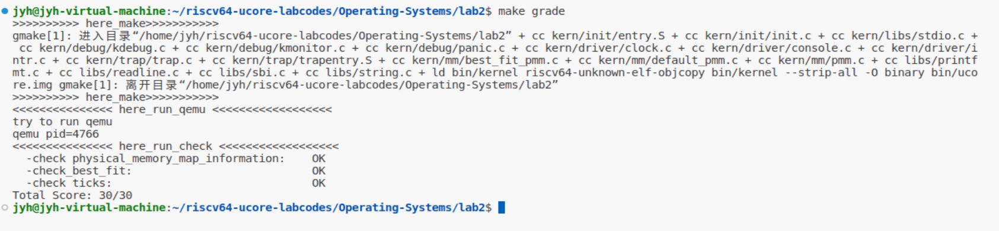
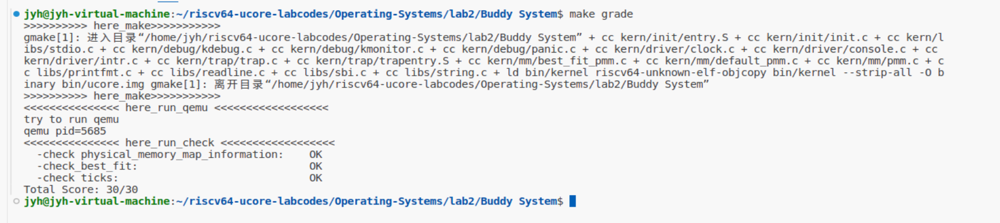

# Lab2实验报告
### 一.实验内容
**练习1：理解first-fit 连续物理内存分配算法**
first-fit 连续物理内存分配算法作为物理内存分配一个很基础的方法，需要同学们理解它的实现过程。请大家仔细阅读实验手册的教程并结合kern/mm/default_pmm.c中的相关代码，认真分析default_init，default_init_memmap，default_alloc_pages， default_free_pages等相关函数，并描述程序在进行物理内存分配的过程以及各个函数的作用。 请在实验报告中简要说明你的设计实现过程。请回答如下问题：

* 你的first fit算法是否有进一步的改进空间？


**练习2：实现 Best-Fit 连续物理内存分配算法**

在完成练习一后，参考kern/mm/default_pmm.c对First Fit算法的实现，编程实现Best Fit页面分配算法，算法的时空复杂度不做要求，能通过测试即可。 请在实验报告中简要说明你的设计实现过程，阐述代码是如何对物理内存进行分配和释放，并回答如下问题：

* 你的 Best-Fit 算法是否有进一步的改进空间？

**扩展练习Challenge：buddy system（伙伴系统）分配算法（需要编程）**

Buddy System算法把系统中的可用存储空间划分为存储块(Block)来进行管理, 每个存储块的大小必须是2的n次幂(Pow(2, n)), 即1, 2, 4, 8, 16, 32, 64, 128...

* 参考伙伴分配器的一个极简实现， 在ucore中实现buddy system分配算法，要求有比较充分的测试用例说明实现的正确性，需要有设计文档。

**扩展练习Challenge：任意大小的内存单元slub分配算法（需要编程）**

slub算法，实现两层架构的高效内存单元分配，第一层是基于页大小的内存分配，第二层是在第一层基础上实现基于任意大小的内存分配。可简化实现，能够体现其主体思想即可。

* 参考linux的slub分配算法/，在ucore中实现slub分配算法。要求有比较充分的测试用例说明实现的正确性，需要有设计文档。

**扩展练习Challenge：硬件的可用物理内存范围的获取方法（思考题）**
* 如果 OS 无法提前知道当前硬件的可用物理内存范围，请问你有何办法让 OS 获取可用物理内存范围？

### 二.练习1实验流程

程序主要使用pmm_init()用来主要负责初始化物理内存管理。在pmm_init()中，首先初始化pmm_maneger为物理内存管理器，进行物理内存的分配和释放。然后将所有物理内存进行初始化，保留内核已经使用的内存，然后在可用物理内存创建空闲页面列表。最后设置页表和使用satp寄存器记录页表的虚拟地址和实现虚拟地址转换为物理地址。物理内存的分配和释放也主要依靠pmm_maneger调用相应封装的函数，即采用first_fit策略的函数。

default_init: 这个函数的作用是在物理内存分配过程中初始化一个空闲内存块链表和空闲页数的计数器，比较简单。具体代码如下：
```cpp
static void
default_init(void) {
    list_init(&free_list);
    nr_free = 0;
}
```
default_init_memmap：这个函数用于初始化一个物理空闲块，将该块中的每一页按地址大小有序添加到块链表之中。具体实现过程为：首先进行一系列断言判断，其次设置该空闲块中的flags、property和ref属性，特别的块首页的property属性设为n，表示该块连续有n个页。然后对应的修改空闲块链表和空闲页数的计数器。在插入到空闲块链表，按照地址进行有序的插入。具体代码如下：
```cpp
static void
default_init_memmap(struct Page *base, size_t n) {
    assert(n > 0);
    struct Page *p = base;
    for (; p != base + n; p ++) {
        assert(PageReserved(p));
        p->flags = p->property = 0;
        set_page_ref(p, 0);
    }
    base->property = n;
    SetPageProperty(base);
    nr_free += n;
    if (list_empty(&free_list)) {
        list_add(&free_list, &(base->page_link));
    } else {
        list_entry_t* le = &free_list;
        while ((le = list_next(le)) != &free_list) {
            struct Page* page = le2page(le, page_link);
            if (base < page) {
                list_add_before(le, &(base->page_link));
                break;
            } else if (list_next(le) == &free_list) {
                list_add(le, &(base->page_link));
            }
        }
    }
}
```


default_alloc_pages： 这个函数的作用是在物理内存分配过程中，按地址顺序分配连续的 n 个物理内存页（first_fit）具体实现过程为：首先进行一系列断言判断，然后然后从空闲块链表中进行遍历，将链表中的元素转换为对应地址的页，判断其块首页的property属性是否大于n，如果是则成功，然后将该块删除。成功后，如果该块原先空闲页数大于n，则将块后面的剩余页数重新添加到块链表之中，同时也进行属性设置和计数器等的修改。最后返回该块首页地址。具体代码如下：
```cpp
static struct Page *
default_alloc_pages(size_t n) {
    assert(n > 0);
    if (n > nr_free) {
        return NULL;
    }
    struct Page *page = NULL;
    list_entry_t *le = &free_list;
    while ((le = list_next(le)) != &free_list) {
        struct Page *p = le2page(le, page_link);
        if (p->property >= n) {
            page = p;
            break;
        }
    }
    if (page != NULL) {
        list_entry_t* prev = list_prev(&(page->page_link));
        list_del(&(page->page_link));
        if (page->property > n) {
            struct Page *p = page + n;
            p->property = page->property - n;
            SetPageProperty(p);
            list_add(prev, &(p->page_link));
        }
        nr_free -= n;
        ClearPageProperty(page);
    }
    return page;
}
```

default_free_pages： 这个函数的作用是将页面重新链接到空闲列表，可能会将小空闲块合并成大空闲块。具体实现过程为：首先进行一系列断言判断，然后如果块中的页不是保留页并且property为0，则将该页释放，块首页property设为n。然后将该块按顺序添加到空闲块链表之中。然后对空闲块链表进行两次判断，分别判断空闲块是否能与前一块合并和后一块合并，如果可以就进行合并。

```cpp
static void
default_free_pages(struct Page *base, size_t n) {
    assert(n > 0);
    struct Page *p = base;
    for (; p != base + n; p ++) {
        assert(!PageReserved(p) && !PageProperty(p));
        p->flags = 0;
        set_page_ref(p, 0);
    }
    base->property = n;
    SetPageProperty(base);
    nr_free += n;

    if (list_empty(&free_list)) {
        list_add(&free_list, &(base->page_link));
    } else {
        list_entry_t* le = &free_list;
        while ((le = list_next(le)) != &free_list) {
            struct Page* page = le2page(le, page_link);
            if (base < page) {
                list_add_before(le, &(base->page_link));
                break;
            } else if (list_next(le) == &free_list) {
                list_add(le, &(base->page_link));
            }
        }
    }

    list_entry_t* le = list_prev(&(base->page_link));
    if (le != &free_list) {
        p = le2page(le, page_link);
        if (p + p->property == base) {
            p->property += base->property;
            ClearPageProperty(base);
            list_del(&(base->page_link));
            base = p;
        }
    }

    le = list_next(&(base->page_link));
    if (le != &free_list) {
        p = le2page(le, page_link);
        if (base + base->property == p) {
            base->property += p->property;
            ClearPageProperty(p);
            list_del(&(p->page_link));
        }
    }
}
```

改进算法：default_pmm采用的是first_fit算法，那么在遍历时必然也是按地址顺序访问，这个无法改变。但是在源代码的查找空闲块进行遍历，都会顺序遍历每块中的每一页，效率低下。既然是块，可以考虑分块查找，即使用块首链表，链表中的每一项都是空闲块中的第一页。这样在分配和释放时，只需使用块首链表查找更快。


### 三.练习2实验流程
在完成了练习1对First Fit的代码进行理解后再分析练习2Best Fit的人物，不难发现我们只需要对分配分配页面的方法进行修改即可。

对于best_fit_init_memmap与best_fit_free_pages函数，实现思路与代码部分都与First Fit算法相同，因此这里只贴出完成的代码段：

```cpp
static void
best_fit_init_memmap(struct Page *base, size_t n) {
    assert(n > 0);
    struct Page *p = base;
    for (; p != base + n; p ++) {
        assert(PageReserved(p));

        /*LAB2 EXERCISE 2: 2210713*/ 
        // 清空当前页框的标志和属性信息，并将页框的引用计数设置为0
        p->flags = p->property = 0;
        set_page_ref(p, 0);
    }
    base->property = n;
    SetPageProperty(base);
    nr_free += n;
    if (list_empty(&free_list)) {
        list_add(&free_list, &(base->page_link));
    } else {
        list_entry_t* le = &free_list;
        while ((le = list_next(le)) != &free_list) {
            struct Page* page = le2page(le, page_link);
             /*LAB2 EXERCISE 2: 2210713*/ 
            // 编写代码
            // 1、当base < page时，找到第一个大于base的页，将base插入到它前面，并退出循环
            // 2、当list_next(le) == &free_list时，若已经到达链表结尾，将base插入到链表尾部
            if(base < page){
                list_add_before(le, &(base->page_link));
                break;
            }
            else if(list_next(le) == &free_list){
                list_add(le, &(base->page_link));
            }
        }
    }
}
```

```cpp
static void
best_fit_free_pages(struct Page *base, size_t n) {
    assert(n > 0);
    struct Page *p = base;
    for (; p != base + n; p ++) {
        assert(!PageReserved(p) && !PageProperty(p));
        p->flags = 0;
        set_page_ref(p, 0);
    }
    /*LAB2 EXERCISE 2: 2210713*/ 
    // 编写代码
    // 具体来说就是设置当前页块的属性为释放的页块数、并将当前页块标记为已分配状态、最后增加nr_free的值
    base->property = n;
    SetPageProperty(base);
    nr_free += n;

    if (list_empty(&free_list)) {
        list_add(&free_list, &(base->page_link));
    } else {
        list_entry_t* le = &free_list;
        while ((le = list_next(le)) != &free_list) {
            struct Page* page = le2page(le, page_link);
            if (base < page) {
                list_add_before(le, &(base->page_link));
                break;
            } else if (list_next(le) == &free_list) {
                list_add(le, &(base->page_link));
            }
        }
    }

    list_entry_t* le = list_prev(&(base->page_link));
    if (le != &free_list) {
        p = le2page(le, page_link);
        /*LAB2 EXERCISE 2: 2210713*/ 
         // 编写代码
        // 1、判断前面的空闲页块是否与当前页块是连续的，如果是连续的，则将当前页块合并到前面的空闲页块中
        // 2、首先更新前一个空闲页块的大小，加上当前页块的大小
        // 3、清除当前页块的属性标记，表示不再是空闲页块
        // 4、从链表中删除当前页块
        // 5、将指针指向前一个空闲页块，以便继续检查合并后的连续空闲页块
        if(p + p->property == base){
            p->property += base->property;
            ClearPageProperty(base);
            list_del(&(base->page_link));
            base = p;
        }
    }

    le = list_next(&(base->page_link));
    if (le != &free_list) {
        p = le2page(le, page_link);
        if (base + base->property == p) {
            base->property += p->property;
            ClearPageProperty(p);
            list_del(&(p->page_link));
        }
    }
}
```

对于分配函数best_fit_alloc_pages，相比于First Fit不同的地方主要在于对于空闲块的搜索。根据定义，First Fit是使用第一个大于等于所需块大小的空闲块进行分配，而Best Fit是从所有不小于所需块大小的空闲块中挑选出最小的一块进行分配。因此，对于Best Fit分配函数寻找相应块的代码部分，我们先定义一个变量size来记录当前所找到的不小于所需块大小的空闲块中最小的一块，当遇到比当前最小块还小的时候更新size，并记录下此时对应的Page。当遍历完整个空闲列表时我们所记录的Page就是所有不小于所需块大小的空闲块中最小的一块，对其进行分配即可，其余代码与First Fit相同。具体代码如下：

```cpp
static struct Page *
best_fit_alloc_pages(size_t n) {
    assert(n > 0);
    if (n > nr_free) {
        return NULL;
    }
    struct Page *page = NULL;
    list_entry_t *le = &free_list;
    size_t min_size = nr_free + 1;
     /*LAB2 EXERCISE 2: 2210713*/ 
    // 下面的代码是first-fit的部分代码，请修改下面的代码改为best-fit
    // 遍历空闲链表，查找满足需求的空闲页框
    // 如果找到满足需求的页面，记录该页面以及当前找到的最小连续空闲页框数量
    while ((le = list_next(le)) != &free_list) {
        struct Page *p = le2page(le, page_link);
        if (p->property >= n && p->property < min_size) {
            page = p;
            min_size = p->property;
        }
    }

    if (page != NULL) {
        list_entry_t* prev = list_prev(&(page->page_link));
        list_del(&(page->page_link));
        if (page->property > n) {
            struct Page *p = page + n;
            p->property = page->property - n;
            SetPageProperty(p);
            list_add(prev, &(p->page_link));
        }
        nr_free -= n;
        ClearPageProperty(page);
    }
    return page;
}
```
完成代码后，打开终端输入make grade指令，结果显示当前实现的Best Fit算法的正确性。



当谈到改进算法的时候，free_list一定是一个主要的改进方向。因为算法多次涉及到了free_list的遍历，如果能提高遍历效率，就能实现优化算法的目的。而从数据结构和算法的角度出发，我们可以从两方面改进：一方面，我们可以改变free_list的存储方式，将free_list中的空闲块按property从小到大的顺序排序；另一方面，链表的查找性能由于其线性性质受限，我们可以借助树形结构，如二叉树、红黑树或堆来进行存储。从上述的两个角度出发，我们就能从单纯考虑算法的角度改进Best Fit算法。


### 四.拓展1实验流程
注：设计文档被整合进本次报告中。Buddy System代码文件夹置于lab2文件夹中，因为Challenge1依靠原代码完成，所以Buddy System的具体代码在Buddy System文件夹下的/kern/mm/best_fit_pmm.c实现。

**1.设计概念：**

本文档描述了描述了基于Buddy System的内存分配和回收机制，通过将内存块分割为2的幂次方的块来高效地管理空闲和已分配内存块。本段代码主要实现了以下三个功能：

* 内存初始化：将内存块初始化为可用状态，并划分为若干个2的幂次方块。
* 内存分配：从所有空闲块中选择最合适的一块分配给用户。
* 内存回收：将指定内存块回收，并在释放后检查是否有可以进行空闲块合并的情况。

**2.辅助函数介绍**

由于实验指导书已经对代码原有的函数和数据结构进行了介绍，这里便不过多赘述。这里着重介绍一下在Buddy System单独实现的函数get_num():

```cpp
//extra function
size_t
get_num(size_t n){
    size_t count = 1;
    while(count < n){
        count <<= 1;
    }
    return count;
}
```
对于输入的参数n，函数会返回一个比它更大的数count，其中count一定是2的幂次方（对于一个只有最高位为1的二进制数，它一定是2的幂次方），相当于模拟理论计算时寻找不小于n的最小的2的幂次方数。因此，当我们想要分配大小为n的内存块时，我们可以调用get_num函数来获取Buddy System分配给用户的内存块大小。


**3.功能设计**

（1）内存初始化

```cpp
//finished
static void
best_fit_init_memmap(struct Page *base, size_t n) {
    assert(n > 0);
    struct Page *p = base;
    for (; p != base + n; p ++) {
        assert(PageReserved(p));
        p->flags = p->property = 0;
        set_page_ref(p, 0);
    }
    nr_free += n;
    size_t block_size = 1;
    while(n > 0){
        size_t temp = n & 1;
        n >>= 1;
        if(temp != 0){
            base->property = block_size;
            SetPageProperty(base);
            list_entry_t *le = &free_list;
            while((le = list_next(le)) != &free_list){
                struct Page *p = le2page(le, page_link);
                if(p->property > base->property ||( p->property == base->property && base < p)){
                    break;
                }
            }
            list_add_before(le, &(base->page_link));
            base += block_size;
        }
        block_size <<= 1;
    }
}
```

在内存初始化函数中，我们先将所有内存块初始化，设置好标志位与引用数，并将空闲内存数加n。接着，我们将整个内存块划分为若干个大小为2的幂次方的块（具体是将n从十进制转为二进制，利用二进制的特性来决定都有哪些块），并将它们依次按指定的顺序（内存块从小到大排序，如果内存块大小相等则按起始地址从小到大排序）插入到空闲链表中。

（2）内存分配

```cpp
//finished
static struct Page *
best_fit_alloc_pages(size_t n) {
    assert(n > 0);
    if (n > nr_free) {
        return NULL;
    }
    size_t size = get_num(n);
    struct Page *page = NULL;
    list_entry_t *le = &free_list;
    while((le = list_next(le)) != &free_list){
        struct Page *p = le2page(le, page_link);
        if(p->property >= size){
            page = p;
            break;
        }
    }
    if(page != NULL){
        while(page->property > size){
            page->property >>= 1;
            struct Page *child = page + page->property;
            child->property = page->property;
            SetPageProperty(child);
            list_entry_t *temp_addr = &free_list;
            while((temp_addr = list_next(temp_addr)) != &free_list){
                struct Page *p = le2page(temp_addr, page_link);
                if(p->property > child->property ||( p->property == child->property && p > child)){
                    break;
                }
            }
            list_add_before(temp_addr, &(child->page_link));
        }
        nr_free -= size;
        ClearPageProperty(page);
        assert(page->property == size);
        list_del(&(page->page_link));
    }
    return page;
}
```

在内存分配函数中，我们先调用之前实现的辅助函数get_num来计算需要多大的空闲块。接着遍历空闲链表，当找到第一个块大小不小于需求块大小的块时就选择该块进行内存分配（根据Buddy System的性质，要先查找有没有刚好符合要求大小的块，如果没有使用尽可能小的块进行拆分）。如果该块要比需求块大小更大，我们需要不断将大块划分为等大的两个子块，并将右边的子块先按照之前指定的顺序插入到空闲链表，再使用左边的子块进行判断。当左边子块的大小等于需求大小（或取出块大小本就等于需求大小），先更新空闲块数以及相应块的状态信息，接着将其从空闲链表中删除，并将该空闲块返回给用户使用。

（3）内存回收

```cpp
//finished
static void
best_fit_free_pages(struct Page *base, size_t n) {
    assert(n > 0);
    n = get_num(n);
    struct Page *p = base;
    for (; p != base + n; p ++) {
        assert(!PageReserved(p) && !PageProperty(p));
        p->flags = 0;
        set_page_ref(p, 0);
    }
    base->property = n;
    SetPageProperty(base);
    nr_free += n;
    list_entry_t *le = &free_list;
    while((le = list_next(le)) != &free_list){
        p = le2page(le, page_link); 
        if(p->property > base->property ||( p->property == base->property && p > base)){
            break;
        }
    }
    list_add_before(le, &(base->page_link));
    if ((p->property == base->property) && (p + p->property == base))
    {
        p->property += base->property;
        ClearPageProperty(base);
        list_del(&(base->page_link));
        base = p;
    }
    le = &(base->page_link);
    while ((le = list_next(le)) != &free_list)
    {
        p = le2page(le, page_link);
        if ((p->property == base->property) && (base + base->property == p))
        {
            base->property += p->property;
            ClearPageProperty(p);
            list_del(&(p->page_link));
            le = &(base->page_link);
        }
        else if((p->property == base->property) && (p + p->property == base)){
            p->property += base->property;
            ClearPageProperty(base);
            list_del(&(base->page_link));
            base = p;
            le = &(base->page_link);
        }
        else if (base->property < p->property || (base->property == p->property && base + base->property < p))
        {
            list_entry_t *targetLe = le;
            if (targetLe != list_next(&base->page_link))
            {
                list_del(&(base->page_link));
                list_add_before(targetLe, &(base->page_link));
            }
            break;
        }
        else if(list_next(le) == &free_list){
            list_del(&(base->page_link));
            list_add(le, &(base->page_link));
            break;
        }
    }
} 
```

Buddy System的内存回收函数是它的核心，与内存分配函数一样，我们先根据n来确定内存块的具体大小，接着更新所有内存块的状态、引用数以及空闲块的个数。接着遍历空闲链表，按照指定的顺序将该空闲块插入到表中。接下来是函数的核心部分，在内存块释放后可能会引起一连串的内存块合并现象，因此我们先查看左边的内存块能不能合并，如果两个块大小相同并且相邻那么就将两个块合并。接下来遍历该块右边的所有空闲块（非常容易可以分析可知，该块最多向左合并一次，而向右则可能会有多次），如果两块的大小相同并且两块相邻，则将两块合并。当无法继续合并时就将该块重新插入到合适的位置即可。

**4.实验验证**

在本部分，我们准备了一些具体的测试样例，具体如下：

```cpp
static void
best_fit_check(void)
{
    int count = 0, total = 0;
    list_entry_t *le = &free_list;
    while ((le = list_next(le)) != &free_list)
    {
        struct Page *p = le2page(le, page_link);
        assert(PageProperty(p));
        count++, total += p->property;
    }
    assert(total == nr_free_pages());
    basic_check();
    struct Page *p0 = alloc_pages(26), *p1;
    assert(p0 != NULL);
    assert(!PageProperty(p0));
    list_entry_t free_list_store = free_list;
    list_init(&free_list);
    assert(list_empty(&free_list));
    assert(alloc_page() == NULL);
    unsigned int nr_free_store = nr_free;
    nr_free = 0;
    free_pages(p0, 26);
    p0 = alloc_pages(6);
    p1 = alloc_pages(10);
    assert((p0 + 8)->property == 8);
    free_pages(p1, 10); 
    assert((p0 + 8)->property == 8);
    assert(p1->property == 16);
    p1 = alloc_pages(16); 
    free_pages(p0, 6); 
    assert(p0->property == 16);
    free_pages(p1, 16); 
    assert(p0->property == 32);
    p0 = alloc_pages(8); 
    p1 = alloc_pages(9); 
    free_pages(p1, 9);   
    assert(p1->property == 16);
    assert((p0 + 8)->property == 8);
    free_pages(p0, 8); 
    assert(p0->property == 32);
    p0 = alloc_pages(5);
    p1 = alloc_pages(16);
    free_pages(p1, 16);
    assert(list_next(&(free_list)) == &((p1 - 8)->page_link));
    free_pages(p0, 5);
    assert(list_next(&(free_list)) == &(p0->page_link));
    p0 = alloc_pages(5);
    p1 = alloc_pages(16);
    free_pages(p0, 5);
    assert(list_next(&(free_list)) == &(p0->page_link));
    free_pages(p1, 16);
    assert(list_next(&(free_list)) == &(p0->page_link));
    p0 = alloc_pages(26);
    assert(nr_free == 0);
    nr_free = nr_free_store;
    free_list = free_list_store;
    free_pages(p0, 26);
    le = &free_list;
    while ((le = list_next(le)) != &free_list)
    {
        assert(le->next->prev == le && le->prev->next == le);
        struct Page *p = le2page(le, page_link);
        count--, total -= p->property;
    }
    assert(count == 0);
    assert(total == 0);
}
```

打开终端输入make grade，结果如下，测试顺利通过，证明了我们实现的正确性。




### 五.拓展2实验流程


### 六.拓展3实验流程
如果OS无法提前知道当前硬件的可用物理内存范围，我们通常会使用硬件辅助或引导程序辅助的方式来帮助OS获取可用物理内存范围，下面是现在行业内经常使用的一些方法：
* **BIOS/UEFI内存映射**：当系统启动时，BIOS 或 UEFI 固件负责初始化硬件资源，并能提供系统内存的详细信息。对于BIOS，它在启动时会提供一个 E820 内存映射表，该表列出系统中的各种内存区域以及它们的属性，例如哪些内存区域是可用的、哪些是保留给设备的、哪些是已映射为 I/O 等。OS可以通过调用BIOS中断***INT 15H, AX=E820H***来查询该表。而对于UEFI，可以通过调用EFI_BOOT_SERVICES中的GetMemoryMap()函数来获得所有可用和不可用的内存范围。
* **ACPI 内存表**：高级配置与电源接口(ACPI)是一个由硬件平台提供的标准，它通过表格结构提供了很多系统配置信息，包括内存布局。OS可以解析 ACPI 提供的 SRAT（系统资源可用性表）和 SLIT（系统局部性信息表）来获取内存范围信息。
* **Multiboot**：某些引导程序在加载操作系统之前，会自动检测系统的内存布局，并将这些信息通过 Multiboot 结构传递给内核。内核在启动时可以直接解析这段信息，获取物理内存范围。
* **总线检测**：某些OS可能会依赖于通过 PCI 或其他硬件总线的扫描机制来确定可用的内存范围。操作系统通过与硬件控制器通信，获取总线的配置信息，从而确定系统的内存资源分布。


### 七.实验中的重要知识点

**1.内存管理**
内存管理是操作系统设计中最重要和最复杂的内容之一。在面对不能将所有用户进程和系统所需要的全部程序与数据放入主存的难题下，操作系统必须对内存空间进行合理的划分和有效的动态分配。操作系统对内存的划分和动态分配，就是内存管理的概念。
在连续分配管理方式中，主要有单一连续分配、固定分区分配以及动态分区分配。此外还有离散分配方式，如段页式存储管理。
* 内存空间的分配与回收。由操作系统负责内存空间的分配和管理，记录内存的空闲空间、内存的分配情况， 并回收已结束进程所占用的内存空间。
* 地址转换。由于程序的逻辑地址与内存中的物理地址不可能一致，因此存储管理必须提供地址变换功能， 将逻辑地址转换成相应的物理地址。
* 内存空间的扩充。利用虚拟存储技术从逻辑上扩充内存。
* 内存共享。指允许多个进程访问内存的同一部分。例如，多个合作进程可能需要访问同一块数据， 因此必须支持对内存共享区域进行受控访问。
* 存储保护。保证各个进程在各自的存储空间内运行，互不干扰。


**2.动态内存分配方式**

动态分区分配也称可变分区分配，是指在进程装入内存时，根据进程的实际需要，动态地为之分配内存，并使分区的大小正好适合进程的需要。因此， 系统中分区的大小和数量是可变的。动态分区在开始时是很好的，但是随着时间的推移，内存中会产生越来越多的小内存块，内存的利用率也随之下降。这些小内存块被称为外部碎片，它存在于所有分区的外部，与固定分区中的内部碎片正好相对。外部碎片可通过紧凑技术来克服，即操作系统不时地对进程进行移动和整理，但是开销和何时紧凑是个问题。将作业装入主存时，需要按照一定的分配算法从空闲分区链(表)中选出一个分区，以分配给该作业。以下是常见的算法：

* First_Fit 算法。空闲分区按地址递增的次序排列。每次分配内存时， 顺序查找到第一个能满足大小的空闲分区，分配给作业。首次适应算法保留了内存高地址部分的大空闲分区，有利于后续大作业的装入。但它会使内存低地址部分出现许多小碎片，而每次分配查找时都要经过这些分区， 因此增加了开销。
* Next_Fit 算法。与First_fit算法不同之处是，分配内存时从上次查找结束的位置开始继续查找。邻近适应算法试图解决该问题。它让内存低、高地址部分的空闲分区以同等概率被分配，划分为小分区，导致内存高地址部分没有大空闲分区可用。通常比首次适应算法更差。
* Best_Fit 算法。空闲分区按容量递增的次序排列。每次分配内存时，顺序查找到第一个能满足大小的空闲分区，即最小的空闲分区，分配给作业。最佳适应算法虽然称为最佳， 能更多地留下大空闲分区， 但性能通常很差，因为每次分配会留下越来越多很小的难以利用的内存块，进而产生最多的外部碎片。
* Worst_Fit 算法。空闲分区按容量递减的次序排列。每次分配内存时， 顺序查找到第一个能满足要求的之空闲分区，即最大的空闲分区，从中分割一部分空间给作业。与最佳适应算法相反，最坏适应算法选择最大的空闲分区，这看起来最不容易产生碎片，但是把最大的空闲分区划分开，会很快导致没有大空闲分区可用， 因此性能也很差。
* 伙伴系统。规定所有分区的大小均为2的k次幂(k为正整数)。当需要为进程分配大小为n的分区时(2ⁱ⁻¹<n≤2ⁱ),在大小为2ⁱ的空闲分区链中查找。若找到， 则将该空闲分区分配给进程。否则， 表示大小为2ⁱ的空闲分区已耗尽， 需要在大小为2ⁱ⁺¹的空闲分区链中继续查找。若存在大小为2ⁱ⁺¹的空闲分区， 则将其等分为两个分区， 这两个分区称为一对伙伴， 其中一个用于分配， 而将另一个加入大小为2ⁱ的空闲分区链。若不存在，则继续查找， 直至找到为止。回收时，也可能需要对伙伴分区进行合并。


**3.虚拟地址**
虚拟地址是程序在运行时使用的地址空间，而不是实际的物理内存地址。虚拟地址空间是由操作系统创建和管理的一个连续的地址范围，每个运行的进程都认为自己拥有一个独立的、连续的内存空间，而虚拟地址空间的大小通常远大于物理内存的大小，这样就不会因为内存不足而无法运行。每个进程都有自己的虚拟地址空间，相应的也有自己的页表，这样即使虚拟地址相同，也可以映射到不同位置，从而提供了进程间的隔离。
* 地址映射：虚拟地址需要通过MMU映射到物理地址上。操作系统通常使用页表负责维护这种映射关系。
* 分页和分段：虚拟地址空间可以被划分为固定大小的页或者段，可以映射到物理内存中的任意位置。
* 多级页表和TLB：引入分页管理后，进程不需要将所有页调入内存，只需将页表保存在内存中。即使这样，页表的大小也可能很大，这就需要使用多级页表，思想和单级页表类似，类似的将页表看成页，在此基础上实现页表即可。这样就调入最高级页表即可。TLB用于存储最近访问页表项，可以减少访存操作。通过局部性原理可知，每级页表都可以使用TLB来减少访存。

**4.进程的内存映像**
不同于存放在硬盘上的可执行程序文件，当一个程序调入内存运行时，就构成了进程的内存映像。一个进程的内存映像由下面组成:
* 代码段:即程序的二进制代码，代码段是只读的，可以被多个进程共享。
* 数据段:即程序运行时加工处理的对象，包括全局变量和静态变量。
* 进程控制块(PCB):存放在系统区。操作系统通过PCB来控制和管理进程。
* 堆:用来存放动态分配的变量。通过调用malloc函数动态地向高地址分配空间。
* 栈:用来实现函数调用。从用户空间的最大地址往低地址方向增长。


### 八.实验外的重要知识点


多线程管理是操作系统中对并发执行线程的创建、调度、同步、通信和销毁等操作进行有效控制的过程。在多线程环境中，操作系统或者应用程序需要确保线程能够高效、正确地执行，同时避免资源冲突和数据不一致的问题。包含：线程的创建和销毁、线程调度、线程同步、线程通信等问题。
在线程同步的知识中：
* 互斥锁：用于保证同一时刻只有一个线程可以访问共享资源。
* 条件变量：允许线程在某些条件下挂起或被唤醒，常与互斥锁配合使用。
* 读写锁：允许多个读操作同时进行，但写操作需要独占访问。
* 信号量：用于控制对资源的访问数量，可以用来实现同步和互斥。

在线程通信的知识中：
* 消息传递：线程通过消息队列进行数据交换。
* 共享内存：线程通过共享内存区域进行数据交换，通常需要同步机制来避免竞态条件。


