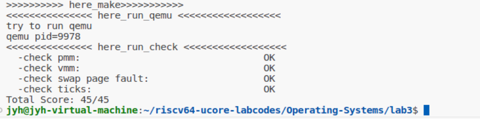

### 练习

对实验报告的要求：
 - 基于markdown格式来完成，以文本方式为主
 - 填写各个基本练习中要求完成的报告内容
 - 完成实验后，请分析ucore_lab中提供的参考答案，并请在实验报告中说明你的实现与参考答案的区别
 - 列出你认为本实验中重要的知识点，以及与对应的OS原理中的知识点，并简要说明你对二者的含义，关系，差异等方面的理解（也可能出现实验中的知识点没有对应的原理知识点）
 - 列出你认为OS原理中很重要，但在实验中没有对应上的知识点
 
#### 练习0：填写已有实验
本实验依赖实验1/2。请把你做的实验1/2的代码填入本实验中代码中有“LAB1”,“LAB2”的注释相应部分。

#### 练习1：理解基于FIFO的页面替换算法（思考题）
描述FIFO页面置换算法下，一个页面从被换入到被换出的过程中，会经过代码里哪些函数/宏的处理（或者说，需要调用哪些函数/宏），并用简单的一两句话描述每个函数在过程中做了什么？（为了方便同学们完成练习，所以实际上我们的项目代码和实验指导的还是略有不同，例如我们将FIFO页面置换算法头文件的大部分代码放在了`kern/mm/swap_fifo.c`文件中，这点请同学们注意）
 - 至少正确指出10个不同的函数分别做了什么？如果少于10个将酌情给分。我们认为只要函数原型不同，就算两个不同的函数。要求指出对执行过程有实际影响,删去后会导致输出结果不同的函数（例如assert）而不是cprintf这样的函数。如果你选择的函数不能完整地体现”从换入到换出“的过程，比如10个函数都是页面换入的时候调用的，或者解释功能的时候只解释了这10个函数在页面换入时的功能，那么也会扣除一定的分数
 
##### 一个页面从被换入到被换出的过程
我们知道一个vma_struct结构体就是一块连续合法的虚拟内存块，包含多个合法的虚拟页。这些虚拟页都是合法的，但这些页中存在某些页并没有映射到物理页，因此也就引发了异常，处理过程为trap-->  exception_handler--> pgfault_handler--> do_pgfault。

在exception_handler()函数中，当异常为CAUSE_LOAD_ACCESS(加载访问异常)、CAUSE_STORE_ACCESS(存储访问异常)、CAUSE_LOAD_PAGE_FAULT(加载页错误) 和 CAUSE_STORE_PAGE_FAULT(存储页错误)时，调用pgfault_handler()来处理page_fault。

在pgfault_handler()函数中，当存在虚拟内存管理器check_mm_struct时，调用do_pgfault()，对异常情况进行处理。
##### 一个页面从被换入到被换出的过程

在do_pgfault()函数中，首先虚拟内存管理器调用find_vma()查找包含访问地址的vma_struct。
 - 如果没有找到或地址不在其范围内，则说明该地址无效，跳转到fail，这时返回的错误为E_INVAL（无效参数）。
 - 如果找到对应的vma_struct，然后使用宏PTE_U设置其为用户态和根据找到的vma_struct的读写权限设置其权限。然后通过宏ROUNDDOWN将地址向下舍入找到最近的页地址addr。然后通过get_pte()尝试在页表中查找或创建页表项ptep并分配相应的物理页。
  - 如果页表项ptep为空，即该页表项对应的物理页面不存在，则需要调用pgdir_alloc_page()为其分配一个物理页。如果分配失败，则说明物理空间不足，跳转到fail，这时返回的错误为E_NO_MEM（物理空间不足）。如果分配成功则创建页表项ptep并分配相应的物理页成功。
  - 如果页表项ptep不为空，说明该页表项对应的物理页面在磁盘中，需要进行替换到内存之中。如果swap已经初始化成功，首先调用swap_in()将该页调入到内存，page保存换入的物理页面。然后调用page_insert()函数来新建页表项。最后通过swap_map_swappable()管理该页面，即加入链表末尾方便FIFO算法的换出。最后设置page的虚拟地址。
##### 一个页面从被换入到被换出的函数作用
- do_pgfault()函数：处理缺页异常。
- find_vma()函数：查找错误的虚拟地址对应的虚拟地址块vma_struct，判断其是否合法。
- get_pte()函数：查找到所在虚拟页后，查找并创建PTE。
- pgdir_alloc_page()函数：将新建的页表项分配物理页，并更新页表项。
- alloc_pages()函数和宏alloc_page()（实际为alloc_pages(n=1)）：用于获得一个空闲的物理页。在首先循环尝试从内存管理器分配页获得一个物理页，如果获得成功就可以退出。如果失败则没有足够的内存，需要调用swap_out()函数向磁盘中按某种策略换出页到磁盘中，这样就分配成功。
- swap_out()函数：从内存中选择换出的页，并将其保存到磁盘中。在swap_out()函数中，首先通过FIFO算法选择要换出的页，然后通过get_pte()函数获得该页的页表项并判断是否有效。然后调用swapfs_write()函数将换出的页写入到磁盘上。最后刷新tlb表。
- swap_out_victim()函数：选择换出页面的算法。
- page_insert()函数：主要用于更新页表。当一个物理页和虚拟页建立映射关系时需要及时更新到页表之中。如果页表项已经存在且不是同一页，那么就会调用page_remove_pte()函数移除改页表项，然后创建新的页表项。
- page_ref_inc()和page_ref_dec()函数：修改物理页引用次数。
- page_remove_pte()函数：减少物理页的引用数，如果为0则释放改页。然后移除对应的页表项并刷新tlb。
- tlb_invalidate()函数：刷新TLB。
- swap_map_swappable()主要通过_fifo_map_swappable()函数将新页链入链表的末尾，方便FIFO算法的实现。
- swap_in()函数：将磁盘上的页换入到内存之中。
- swapfs_read()函数：读取硬盘的页到物理内存之中。
- swapfs_write()函数：将换出的页写入到物理内存之中。

#### 练习2：深入理解不同分页模式的工作原理（思考题）
get_pte()函数（位于`kern/mm/pmm.c`）用于在页表中查找或创建页表项，从而实现对指定线性地址对应的物理页的访问和映射操作。这在操作系统中的分页机制下，是实现虚拟内存与物理内存之间映射关系非常重要的内容。
 - get_pte()函数中有两段形式类似的代码， 结合sv32，sv39，sv48的异同，解释这两段代码为什么如此相像。
 - 目前get_pte()函数将页表项的查找和页表项的分配合并在一个函数里，你认为这种写法好吗？有没有必要把两个功能拆开？
##### get_pte()函数中有两段形式类似的代码， 结合sv32，sv39，sv48的异同，解释这两段代码为什么如此相像。
sv32，sv39，sv48的异同具体如下：
 - sv32：使用 32 位虚拟地址空间，最大支持 4GB 的虚址地址空间。使用 2 级页表，页目录项和页表项各占 32 位，虚拟地址分为 10 位页目录偏移、10 位页表偏移、12 位页内偏移。每个页表项映射 4KB 页，所以一个页表项映射一个 4KB 的物理页。
 - sv39：使用 39 位虚拟地址空间，最大支持 512GB 的虚拟地址空间。使用 3 级页表，页目录项和页表项各占 64 位，虚拟地址分为 9 位页目录索引偏移 PDX1、9 位页目录偏移 PDX0、9 位页表偏移 PTX、12 位页内偏移PPN。每个页表项通常映射 4KB 页，但也可以支持更大的大页。
 - sv48：使用 48 位虚拟地址空间，最大支持 256TB 的虚址地址空间。使用 4 级页表，页目录项和页表项各占 64 位，虚拟地址分为 9 位三级页目录偏移、9 位页二级目录偏移、9 位页目录偏移、9 位页表偏移、12 位页内偏移。每个页表项通常映射 4KB 页，但也可以支持更大的大页

 ```cpp
    pde_t *pdep1 = &pgdir[PDX1(la)];
    if (!(*pdep1 & PTE_V)) {
        struct Page *page;
        if (!create || (page = alloc_page()) == NULL) {
            return NULL;
        }
        set_page_ref(page, 1);
        uintptr_t pa = page2pa(page);
        memset(KADDR(pa), 0, PGSIZE);
        *pdep1 = pte_create(page2ppn(page), PTE_U | PTE_V);
    }
    pde_t *pdep0 = &((pde_t *)KADDR(PDE_ADDR(*pdep1)))[PDX0(la)];
    if (!(*pdep0 & PTE_V)) {
    	struct Page *page;
    	if (!create || (page = alloc_page()) == NULL) {
    		return NULL;
    	}
    	set_page_ref(page, 1);
    	uintptr_t pa = page2pa(page);
    	memset(KADDR(pa), 0, PGSIZE);
 //   	memset(pa, 0, PGSIZE);
    	*pdep0 = pte_create(page2ppn(page), PTE_U | PTE_V);
    }
    return &((pte_t *)KADDR(PDE_ADDR(*pdep0)))[PTX(la)];
 ```

get_pte() 函数的功能是给定虚拟地址，通过多级页表查询，最终查找对应的PTE，如果不存在，可以通过参数来判断是否创建新的PTE，过程为：首先利用给定的虚拟地址的PDX1通过页目录索引pgdir查找页目录索引项找到页目录，然后利用给定的虚拟地址的PDX0通过页目录查找页目录项找到页表，最后返回利用给定的虚拟地址的PTX通过页表查找页表项PTE。这里都要考虑如果查找不到对应的页目录索引项或页目录项的情况，如果查找不到、create为1并且有空闲的内存块进行分配，那么就新建相应的页目录索引项或页目录项，然后将物理页和页目录索引项或页目录项初始化并设置值。它中有两段形式类似的代码，这是由于它们都在多级页表查询的缘故，一个是在页目录索引中查询，一个是在页目录中查询而已。

在sv32，sv39，sv48中分别使用了2、3、4级页表，它们本质上并无太大差别，都是要通过多级页表来查询虚拟地址对应的PTE。sv39中查询PTE的方式如上；sv32使用2级页表，那么在上面代码中相应的只需要从PDX0中查找即可，不需要先从PDX1中查找页目录；sv32使用4级页表，那么在上面代码中相应的需要增加一级查找，首先从PDX2中查找页目录索引，然后才能按照上面代码的逻辑进行查找。


##### 目前get_pte()函数将页表项的查找和页表项的分配合并在一个函数里，你认为这种写法好吗？有没有必要把两个功能拆开？

我们认为目前get_pte()函数将页表项的查找和页表项的分配合并在一个函数里的写法合理，不需要分开，理由如下：

get_pte()函数的目的就是查找或者创建一个PTE，通过参数create来决定是否在缺失处创建一个新的表项。在u_core中，只有发生了缺页异常（未分配物理页或者换出到磁盘上），才会调用do_pgfault()函数来解决缺页异常，而do_pgfault()函数处理缺页异常要直接和间接调用get_pte()函数，就要通过多级页表一级一级的查询出在哪里出现未分配的情况，这个时候查询为空的情况下直接进行分配空闲块或者换出块即可。然后如果PTE为空说明分配一个物理页，要新建一个页表项；非空则说明对应的物理页被换出，现在需要换入。优点如下：
 - 首先这时发生了缺页异常才会调用get_pte()，那么就有可能是为未分配物理页的错误。这时只需将参数create设为1即可，那么未在分配物理页的情况下查找表项为空就可以立即进行分配，减少了调用分配函数的开销。面对换出到磁盘上的情况下，由于其各表项有效，也不用进行额外的参数create判断，并没有增加开销。
 - 如果只有一个查找函数是无法区分是页目录缺失，页表缺失的情况，这需要进行额外判断。如果使用两个函数，这样就会带来额外函数调用的开销。


#### 练习3：给未被映射的地址映射上物理页（需要编程）
补充完成do_pgfault（mm/vmm.c）函数，给未被映射的地址映射上物理页。设置访问权限 的时候需要参考页面所在 VMA 的权限，同时需要注意映射物理页时需要操作内存控制 结构所指定的页表，而不是内核的页表。
请在实验报告中简要说明你的设计实现过程。请回答如下问题：
 - 请描述页目录项（Page Directory Entry）和页表项（Page Table Entry）中组成部分对ucore实现页替换算法的潜在用处。
 - 如果ucore的缺页服务例程在执行过程中访问内存，出现了页访问异常，请问硬件要做哪些事情？
- 数据结构Page的全局变量（其实是一个数组）的每一项与页表中的页目录项和页表项有无对应关系？如果有，其对应关系是啥？
##### 代码实现
```cpp
......
if (swap_init_ok)
{
     struct Page *page = NULL;
    // 你要编写的内容在这里，请基于上文说明以及下文的英文注释完成代码编写
    //(1）According to the mm AND addr, try
    // to load the content of right disk page
    // into the memory which page managed.
    if((ret=swap_in(mm,addr,&page))!=0){
        cprintf("swap_in in do_pgfault failed\n");
        goto failed;
    }
    //(2) According to the mm,
    // addr AND page, setup the
    // map of phy addr <--->
    // logical addr
    page_insert(mm->pgdir, page, addr, perm) ;
    //(3) make the page swappable.
    swap_map_swappable(mm, addr, page, 1);
    page->pra_vaddr = addr;
}
......
```
首先外层如果查找到的PTE不为0，说明该页在磁盘之中，才会进入到这段代码之中。如果允许交换，那么我们就将磁盘上的页换入到内存之中。首先调用swap_in函数来将需要的物理页读入内存，如果内存不足的话就会换出一个页面。然后调用page_insert来设置页表项，并修改物理页的映射，最后把其可交换属性设置为真，插入FIFO的队列中。
##### 请描述页目录项（Page Directory Entry）和页表项（Page Table Entry）中组成部分对ucore实现页替换算法的潜在用处。

页目录项和页表项中的PTE_A位表示页是否被访问，PTE_V位表示其有效，PTE_D位表示页是否被修改，通过这些位可以实现页替换算法。


##### 如果ucore的缺页服务例程在执行过程中访问内存，出现了页访问异常，请问硬件要做哪些事情？

- 异常产生后，会跳转到stvec寄存器（设置内核态中断处理流程的入口地址，存储了一个基址 BASE 和模式）保存的地址执行指令。由于内核初始化时将stvec寄存器设置为__alltraps函数的地址，因此就跳转到trapentry.S中的__alltraps处执行。

- alltraps执行时调用 SAVE_ALL宏，进行当前进程的上下文保存，并将其打包成一个结构体作为trap函数的一个参数来调用trap函数再次进入到trap.c文件中。

- trap函数根据上下文结构体调用trap_dispatch来判断当前中断是中断还是异常，并执行对应的函数（中断对应interrupt_handler函数，异常对应exception_handler函数）。

- 如果是缺页异常，则调用过程为exception_handler()->pgfault_handler()->do_pgfault()。

- 处理完毕后，返回到trapentry.S中，调用RESTORE_ALL宏来执行上下文回复的工作，中断处理完成。

##### 数据结构Page的全局变量（其实是一个数组）的每一项与页表中的页目录项和页表项有无对应关系？如果有，其对应关系是啥？
```cpp
struct Page {
    int ref;                        // page frame's reference counter
    uint_t flags;                 // array of flags that describe the status of the page frame
    uint_t visited;
    unsigned int property;          // the num of free block, used in first fit pm manager
    list_entry_t page_link;         // free list link
    list_entry_t pra_page_link;     // used for pra (page replace algorithm)
    uintptr_t pra_vaddr;            // used for pra (page replace algorithm)
};
```
数据结构Page的全局变量与页目录项和页表项之间并没有一对一的直接对应关系。页表项负责记录虚拟页与物理页之间的映射，而 struct Page 主要用于管理物理内存页的状态（例如是否被引用、是否可用、是否在空闲链表中等）。虚拟页并不直接使用数据结构 Page，而是由页表项和多级页目录项来映射到物理页。每个虚拟页通过页表项与物理页进行关联。而每个虚拟页的访问权限通过PTE中的标志位来控制，这点和物理内存页Page的状态是相同的。


#### 练习4：补充完成Clock页替换算法（需要编程）
通过之前的练习，相信大家对FIFO的页面替换算法有了更深入的了解，现在请在我们给出的框架上，填写代码，实现 Clock页替换算法（mm/swap_clock.c）。
请在实验报告中简要说明你的设计实现过程。请回答如下问题：
 - 比较Clock页替换算法和FIFO算法的不同。

##### Clock页替换算法的设计

通过前面的练习，我们已经对FIFO算法的原理和实现有了一定的了解，结合我们课上所学的Clock算法的理论实现，我们不难想到Clock算法的设计思路。Clock算法不得不提到的一个关键变量就是**visited**，每个Page都用该变量来表示是否有访问过该页。Clock算法的初始化函数基本与FIFO算法相同，映射函数也仅仅多了为Page置位visited而已。关键的不同在于替换算法，当页满时，Clock算法会从当前指针停留位置开始遍历所有可替换Page，若该页的visited为1则意味着“近期”被访问过，因此将访问位置0，同时指针向后移动；若该页的visited位为0则直接将该页替换出内存为新页腾出空间（体现为从双向链表中删除该Page），并将当前指针再次向后移动一位，之后退出算法（向后移动一位的操作为理论上指定，不过也可以理解，毕竟刚刚新访问的页一定不会被马上替换出内存）。

##### Clock算法与FIFO算法的不同
两种局部页面置换算法的不同就在于当内存满时对被替换页面（victim）的选择：FIFO算法认为内存中所有页面中最早被访问的一个应该被换出内存，因此它会直接删掉双向链表中最后的页面（FIFO算法中是头插法，因此双向链表最后的Page一定是最早插入的，Clock算法就没有这样的说法）。而Clock算法则考虑了一些更“类人”的想法，认为最近没有被访问的页面才应该被替换出去，但是LRU算法的成本因此又过于高昂，因此只为每个Page额外分配一个visited位，当需要置换时就换出第一个发现的“近期”没有被访问的Page，但这个Page究竟是不是最久没有被访问过的Page则不得而知。

##### Clock算法的具体实现

初始化函数和FIFO算法几乎相同：先初始化链表头，再将mm的指针sm_priv指向链表头，便于算法后续执行。唯一的不同就是将curr_ptr也指向链表头，curr_ptr的作用刚才已经讨论过，这里不再赘述。


映射函数则与FIFO算法略有差距：首先我们不用特意地使用头插法，而是直接将新Page插在链表尾部即可（因为Page的位置不会再影响替换）；其次对于新映射进内存的Page我们需要将其的visited位置为1，因为本质上将该Page替换进入内存的过程也访问了该页（或者理解为我们不希望刚替换进入内存的页面下一次便被换出内存也可）。


替换函数则和FIFO算法的实现有着较大的差别。和刚才介绍的一样，Clock算法的替换函数会从当前指针所指向的链表中的页面开始遍历，当当前指向页面的visited为1时将其置为0，指针向前移动；当visited为0时则将其从链表中删掉，并将该页以指针的形式从函数中拿走，同时指针向后移动一位。

完成两个编程练习后，我们可以使用**make grade**指令来验证相应的正确性。打开终端输入make grade，查看输出结果，证明我们编程练习的正确性。



#### 练习5：阅读代码和实现手册，理解页表映射方式相关知识（思考题）
如果我们采用”一个大页“ 的页表映射方式，相比分级页表，有什么好处、优势，有什么坏处、风险？

##### 好处

- ”一个大页“ 的页表映射方式只需要一次内存访问便可查找到物理地址，因此查表的开销较小，查找速度更快。而分级页表会因为多层级查找带来较高的内存访问延迟。

- ”一个大页“ 的页表映射方式结构更为简单，因为它不需要维护多层次结构，避免了管理不同级别页表的复杂性。这也意味着页表的代码实现和管理更加容易。

- ”一个大页“ 的页表映射方式对于大页的使用，常常意味着更多的连续内存块可以被映射，这减少了页表项的数量，降低了页表的大小，减少了缺页中断的发生。

##### 坏处

- ”一个大页“ 的页表映射方式需要存储所有虚拟页面的映射，因此在支持大内存空间时，单级页表的内存消耗非常大。每个虚拟地址空间都需要一个独立的大页表，占用大量内存资源。

- 随着虚拟内存空间增大，”一个大页“ 的页表映射方式对应页表的大小也迅速增大，不利于系统扩展。分级页表可以根据实际需求分配页表的不同层级，降低了实际的内存占用，使系统具备更好的扩展性。

- ”一个大页“ 的页表映射方式由于页表较大，单级页表很难完全被缓存，导致在查找时频繁访问内存，反而可能影响整体性能。分级页表结构较小且分散，可能更容易在TLB等高速缓存中获得较高的命中率。

- ”一个大页“ 的页表映射方式事实上还可能会引起内存浪费和内存碎片等各自严重的性能问题。

#### 扩展练习 Challenge：实现不考虑实现开销和效率的LRU页替换算法（需要编程）
challenge部分不是必做部分，不过在正确最后会酌情加分。需写出有详细的设计、分析和测试的实验报告。完成出色的可获得适当加分。

##### LRU算法的分析与实现
LRU算法是目前不考虑成本的情况下我们接触过的性能最好的替换算法之一，它是Farthest in Future算法的一种贪心近似。在LRU算法中，如果我们需要从页满的内存中替换出一个空闲位置为要新加入内存的Page，那通常会选择换掉距离上次访问最远的Page。根据原理可知，LRU算法的硬件成本非常高昂，较为复杂的一种实现就是开辟一个内存可存放Page数量的数组来记录每个Page在当前的顺序（LRU替换的实现就是每个在内存的Page都拿着一个数字，记录自己在当前未被访问的回合数，数字最大的Page会在下次被换出去）；另外一个近似算法则是只记录最近被访问的Page，当需要替换的时候从剩下的页面随机选择一个页面替换出去。

但我们通过前面的练习，发现事实上可以基于FIFO算法来实现LRU算法。事实上，如果我们假设时钟中断足够小，小到只允许完成一次对内存Page的访问，那么我们就可以检查在两次时钟中断中间访问了哪个页面，并将其移动到链表头部即可，这在实现过程和效果上和其他方法是一样的效果。

接下来我们来介绍一下具体的实现过程：

首先改动的是映射函数，确保每次访问时将相应的visited位置为1，表示在这次间隔中访问的是该页，在中断时将该页调整至链表头部。FIFO算法的其他主体部分则保存不变。


主要改动的是tick_event，在新的tick_event中我们要遍历整个双向链表，确定在本次间隔在访问的是哪个具体的Page，当发现相应的Page时就将其移动到链表的头部（具体为一次插入一次删除两步操作），同时将其visited位置为0。

##### 测试样例的设置

对于测试样例的设置，我们选择在原FIFO算法的测试样例上进行修改。对于测试函数，我们只需要修改assert语句即可，下表为每个时刻的理论上的内存状态和缺页次数：

| 时刻 | 内存状态 | 缺页次数 |
| :--- | ---: | :---: |
| 1 | C | 1 |
| 2 | C A | 2 |
| 3 | C A D | 3 |
| 4 | C A D B | 4 |
| 5 | A D B E | 5 |
| 6 | A D E B | 5 |
| 7 | D E B A | 5 |
| 8 | D E A B | 5 |
| 9 | E A B C | 6 |
| 10 | A B C D | 7 |
| 11 | B C D E | 8 |
| 12 | C D E A | 9 |

随后我们对编写的LRU算法代码进行测试。打开终端输入make qemu，显示结果如下图，证明了我们实现的正确性。


#### 实验中的知识点
##### 页和页表
我们希望内存的使用能尽量避免碎片的产生，这就引入了分页的思想：将内存空间分为若干固定大小的分区。进程的虚拟地址空间也分为与块大小相等的若干区域，操作系统以页为单位为各个进程分配内存空间。分页管理不产生外部碎片，进程只会在为最后一个不完整的块申请一个主存块空间时，才产生主存碎片，所以尽管会产生内部碎片， 但这种碎片相对于进程来说也是很小的。页面大小应该适中，页面太小会使进程的页面数过多，这样页表就会过长，占用大量内存，而且也会增加硬件地址转换的开销，降低页面换入/换出的效率；页面过大又会使页内碎片增多，降低内存的利用率。

为了便于实现从页号到物理块号的地址映射，即找到进程的每个页面在内存中存放的位置，系统为每个进程建立一张页面映射表，简称页表。进程的每个页面对应一个页表项，每个页表项由页号和块号组成，它记录了页面在内存中对应的物理块号。进程执行时，通过查找页表，即可找到每页在内存中的物理块号。

为了提高地址变换的速度，在系统中设置一个页表寄存器(PTR)，存放页表在内存的始址和页表长度。

##### 快表
若页表全部放在内存中，则存取一个数据或一条指令要多次访问内存。显然，这种方法比通常执行指令的速度很多。考虑局部性原理，在地址变换机构中增设一个具有并行查找能力的高速缓冲存储器——快表(TLB)，用来存放当前访问的若干页表项，以加速地址变换的过程。具有快表的地址变换机构如下所示。


- CPU给出虚拟地址后， 由硬件进行地址转换， 将页号与快表中的所有页号进行比较。
- 若找到匹配的页号， 说明要访问的页表项在快表中有副本， 则直接从中取出该页对应的页框号， 与页内偏移量拼接形成物理地址。这样， 存取数据仅一次访存即可实现。
- 若未找到匹配的页号， 则需要访问主存中的页表， 读出页表项后， 应同时将其存入快表，以便后面可能的再次访问。若快表已满， 则须按照特定的算法淘汰一个旧页表项。

##### 多级页表

引入分页管理后，进程在执行时不需要将所有页调入内存页框， 而只需将保存有映射关系的页表调入内存。但仍需考虑页表的大小，而且还要求是连续的，显然这是不切实际的。

页表占用内存过多的问题。实际上就是为离散分配的页表再建立一张页表， 称为外层页表(或页目录)。当采用两级分页时，对页表再进行分页，得到页目录。三级页表时，对页目录再进行分页，得到页目录索引。以此类推，这样就可以实现多级页表，减少页表、页目录在内存过大的情况。这时候也为页目录设置快表。


