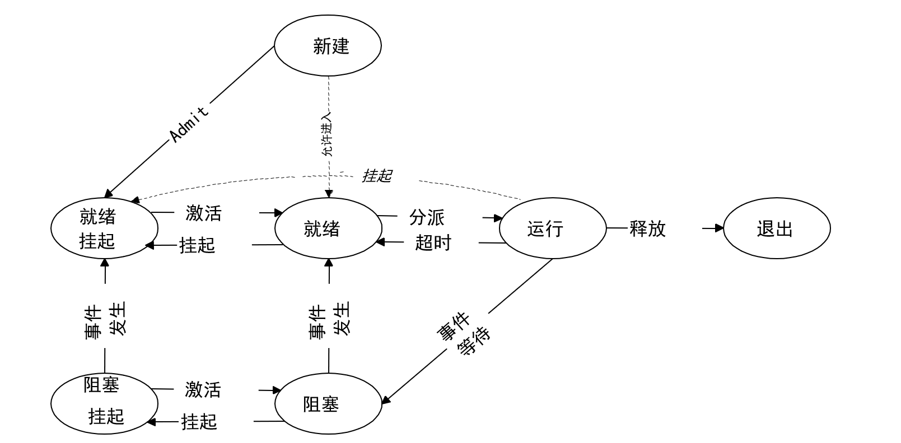

# Lab4实验报告
### 一.实验内容
**练习0：填写已有实验**
本实验依赖实验2/3。请把你做的实验2/3的代码填入本实验中代码中有“LAB2”,“LAB3”的注释相应部分。

**练习1：分配并初始化一个进程控制块（需要编码）**
alloc_proc函数（位于kern/process/proc.c中）负责分配并返回一个新的struct proc_struct结构，用于存储新建立的内核线程的管理信息。ucore需要对这个结构进行最基本的初始化，你需要完成这个初始化过程。

请在实验报告中简要说明你的设计实现过程。请回答如下问题：

* 请说明proc_struct中struct context context和struct trapframe *tf成员变量含义和在本实验中的作用是啥？（提示通过看代码和编程调试可以判断出来）


**练习2：为新创建的内核线程分配资源（需要编码）**

创建一个内核线程需要分配和设置好很多资源。kernel_thread函数通过调用do_fork函数完成具体内核线程的创建工作。do_kernel函数会调用alloc_proc函数来分配并初始化一个进程控制块，但alloc_proc只是找到了一小块内存用以记录进程的必要信息，并没有实际分配这些资源。ucore一般通过do_fork实际创建新的内核线程。do_fork的作用是，创建当前内核线程的一个副本，它们的执行上下文、代码、数据都一样，但是存储位置不同。因此，我们实际需要"fork"的东西就是stack和trapframe。在这个过程中，需要给新内核线程分配资源，并且复制原进程的状态。你需要完成在kern/process/proc.c中的do_fork函数中的处理过程。它的大致执行步骤包括：

* 调用alloc_proc，首先获得一块用户信息块。
* 为进程分配一个内核栈。
* 复制原进程的内存管理信息到新进程（但内核线程不必做此事）
* 复制原进程上下文到新进程
* 将新进程添加到进程列表
* 唤醒新进程
* 返回新进程号

请在实验报告中简要说明你的设计实现过程。请回答如下问题：

* 请说明ucore是否做到给每个新fork的线程一个唯一的id？请说明你的分析和理由。

**练习3：编写proc_run 函数（需要编码）**
proc_run用于将指定的进程切换到CPU上运行。它的大致执行步骤包括：
* 检查要切换的进程是否与当前正在运行的进程相同，如果相同则不需要切换。
* 禁用中断。你可以使用/kern/sync/sync.h中定义好的宏local_intr_save(x)和local_intr_restore(x)来实现关、开中断。
* 切换当前进程为要运行的进程。
* 切换页表，以便使用新进程的地址空间。/libs/riscv.h中提供了lcr3(unsigned int cr3)函数，可实现修改CR3寄存器值的功能。
* 实现上下文切换。/kern/process中已经预先编写好了switch.S，其中定义了switch_to()函数。可实现两个进程的context切换。
* 允许中断。

请回答如下问题：

* 在本实验的执行过程中，创建且运行了几个内核线程？

完成代码编写后，编译并运行代码：make qemu

如果可以得到如 附录A所示的显示内容（仅供参考，不是标准答案输出），则基本正确。

**扩展练习Challenge**
* 说明语句local_intr_save(intr_flag);....local_intr_restore(intr_flag);是如何实现开关中断的？

### 二.练习1实验过程
#### 问题一：完成在kern/process/proc.c中的do_fork函数中的处理过程
alloc_proc函数负责分配并返回一个新的struct proc_struct结构，用于存储新建立的内核线程的管理信息。
```cpp
alloc_proc(void)
{
    struct proc_struct *proc = kmalloc(sizeof(struct proc_struct));
    if (proc != NULL)
    {
        proc->state = PROC_UNINIT; // 设置进程为“初始”态
        proc->pid = -1;            // 设置进程pid的未初始化值-1
        proc->runs = 0;            // 初始化运行时间为0
        proc->kstack = 0;          // 设置内核栈地址
        proc->need_resched = 0;    // 设置进程不需要调度
        proc->parent = NULL;
        proc->mm = NULL;                                     // 虚拟内存管理指针为空
        memset(&(proc->context), 0, sizeof(struct context)); // 初始化上下文
        proc->tf = NULL;                                     // 中断帧指针
        proc->cr3 = boot_cr3;                                // 使用内核页目录表的基址
        proc->flags = 0;                                     // 进程标志位
        memset(proc->name, 0, PROC_NAME_LEN);                // 进程名称
    }
    return proc;
}
```
#### 问题二：proc_struct中struct context context和struct trapframe *tf成员变量含义和在本实验中的作用是啥？

context保存了ra、sp、s0-s11共十四个寄存器，通过保存和恢复这些寄存器，用于在进程切换中还原之前进程的运行状态。context不需要保存所有的寄存器，利用编译器会自动帮助我们生成保存和恢复调用者保存寄存器的代码，因此在实际的进程切换过程中我们只需要保存被调用者保存寄存器。即在switch.S中的switch_to函数已经将调用者的寄存器进行保存

在copy_thread函数中：将上下文中的ra设置为了forkret函数的入口，并且在forkret函数中把传进来的参数，即进程的中断帧放在了栈顶sp。这样在__trapret函数中就可以直接从中断帧里面恢复所有的寄存器。此外s0寄存器里放的是新进程要执行的函数，s1寄存器里放的是传给函数的参数。
```cpp
static void
copy_thread(struct proc_struct *proc, uintptr_t esp, struct trapframe *tf) {
    ......
    proc->context.ra = (uintptr_t)forkret;
    proc->context.sp = (uintptr_t)(proc->tf);
}
```

trapframe里保存了进程的中断帧。当进程从用户空间进入内核空间时，进程的执行状态被保存在了中断帧中，用于保存进程在发生中断或异常时的信息。系统调用可能会改变用户寄存器的值，可以通过调整中断帧来使得系统调用返回特定的值。

在copy_thread函数中：trapframe表明子进程是通过fork调用创建的。在kernel_thread函数中：设置内核线程的参数和函数指针，保存kernel_thread_entry函数的地址，并设置了status寄存器调整中断设置。
```cpp
static void
copy_thread(struct proc_struct *proc, uintptr_t esp, struct trapframe *tf) {
    ......
    proc->tf->gpr.a0 = 0; // 表明子进程是通过fork调用创建的
    proc->tf->gpr.sp = (esp == 0) ? (uintptr_t)proc->tf : esp;
}

int kernel_thread(int (*fn)(void *), void *arg, uint32_t clone_flags) {
    ......
    tf.gpr.s0 = (uintptr_t)fn; // s0 寄存器保存函数指针
    tf.gpr.s1 = (uintptr_t)arg; // s1 寄存器保存函数参数
    // 设置 trapframe 中的 status 寄存器
    tf.status = (read_csr(sstatus) | SSTATUS_SPP | SSTATUS_SPIE) & ~SSTATUS_SIE;
    // 将入口点（epc）设置为 kernel_thread_entry 函数，作用实际上是将pc指针指向它
    tf.epc = (uintptr_t)kernel_thread_entry;
    ......
}
```
forkret函数会将进程的中断帧trapframe放到栈顶，然后调用trapret函数，在__trapret中将中断帧里面恢复所有的寄存器。然后通过epc寄存器跳转到kernel_thread_entry函数，调用s0寄存器里保存的函数和s01寄存器里保存的函数参数，至此完成了中断恢复，成功创建并切换到了内核进程。

### 三.练习2实验过程
do_fork的作用是，创建当前内核线程的一个副本，它们的执行上下文、代码、数据都一样，但是存储位置不同。
#### 问题一：完成do_fork函数中的处理过程
```cpp
    //    1. call alloc_proc to allocate a proc_struct
    if ((proc = alloc_proc()) == NULL)
    {
        goto fork_out;
    }
    proc->parent = current;
    //    2. call setup_kstack to allocate a kernel stack for child process
    if (setup_kstack(proc) != 0)
    {
        goto bad_fork_cleanup_proc;
    }
    //    3. call copy_mm to dup OR share mm according clone_flag
    if (copy_mm(clone_flags, proc) != 0)
    {
        goto bad_fork_cleanup_kstack;
    }
    //    4. call copy_thread to setup tf & context in proc_struct
    copy_thread(proc, stack, tf);

    //    5. insert proc_struct into hash_list && proc_list
    bool intr_flag;
    local_intr_save(intr_flag); 
    proc->pid = get_pid();
    hash_proc(proc);
    list_add(&proc_list, &(proc->list_link));
    nr_process++;
    local_intr_restore(intr_flag);
    //    6. call wakeup_proc to make the new child process RUNNABLE
    wakeup_proc(proc);
    //    7. set ret vaule using child proc's pid
    ret = proc->pid;
```
根据注释：
* 1.调用alloc_proc函数分配一个proc_struct结构体。
* 2.调用setup_kstack函数为子进程在内核栈分配空间。
* 3.调用copy_mm函数复制原进程的内存管理信息到子进程（但内核线程不必做此事）。
* 4.调用copy_thread函数复制父进程的trapframe，并设置context。
* 5.调用get_pid函数为新进程分配一个唯一的进程号，然后调用hash_proc函数把新进程的PCB插入到哈希表中，最后调用list_add函数把PCB插入到进程控制表中。在添加到进程链表的过程中，通过屏蔽和恢复中断来保证添加进程操作不会被抢断。
* 6.调用wakeup_proc函数唤醒子进程。
* 7.设置返回值为子进程的pid。


#### 问题二：请说明ucore是否做到给每个新fork的线程一个唯一的id？
ucore使用get_pid函数为新进程分配一个唯一的进程号。

在get_pid函数中使用了两个静态变量last_pid和next_safe。last_pid用于记录上一个进程的pid，next_safe表示比last_pid大的一个最小的使用过的pid，用区间(last_pid,next_safe)表示可以直接获取的空闲pid。如果last_pid >= next_safe，则按pid增大的顺序寻找最小可用的进程号，将last_pid更新为该进程号，将next_saf更新为示比last_pid大的一个最小的使用过的pid，如果超过MAX_PID，则从头查找。


### 四.练习3实验过程
proc_run位于proc.c文件中，具体编写后的代码如下：
```cpp
// proc_run - make process "proc" running on cpu
// NOTE: before call switch_to, should load  base addr of "proc"'s new PDT
void
proc_run(struct proc_struct *proc) {
    if (proc != current) {
        // LAB4:EXERCISE3 2210713
        /*
        * Some Useful MACROs, Functions and DEFINEs, you can use them in below implementation.
        * MACROs or Functions:
        *   local_intr_save():        Disable interrupts
        *   local_intr_restore():     Enable Interrupts
        *   lcr3():                   Modify the value of CR3 register
        *   switch_to():              Context switching between two processes
        */
       bool intr_symbol;
       struct proc_struct *temp = current;
       local_intr_save(intr_symbol);
       {
            current = proc;
            lcr3(current->cr3);
            switch_to(&(temp->context), &(current->context));
       }
       local_intr_restore(intr_symbol);
    }
}
```
先判断是否要切换占用CPU的进程和当前进程为一个进程，如为一个则不做处理，否则进行下面的步骤：我们先初始化一个Bool型变量，为后续关中断做准备，接着初始化一个proc_struct来记录当前的进程，为一会上下文切换做准备。使用定义好的宏local_intr_save来关中断，然后切换进程为我们指定好的进程，利用lcr3来切换页表到新进程的页表，最后完成原进程和新进程的上下文切换就完成了进程的完整切换流程。最后开中断就完成所有工作，函数结束。

在本实验的执行过程中，创建并运行了两个进程，它们分别是：

* **idleproc**:idleproc是一个在操作系统中常见的概念，用于表示空闲进程。在操作系统中，空闲进程是一个特殊的进程，它的主要目的是在系统没有其他任务需要执行时，占用 CPU 时间，同时便于进程调度的统一化。此外，它还会不停地查询，看是否有其他内核线程可以执行了，如果有，马上让调度器选择那个内核线程执行。由于本次实验只有两个进程，因此idleproc的工作就是将CPU的运行权让给initproc。

* **initproc**:在实验四中,initproc的工作就是输出一些字符串(Hello World)，然后就返回了,，表明自己存在且能正常工作了，同时也表明初始化进程的工作成功了。
### 五.Challenge实验过程
首先找到local_intr_save和local_intr_restore定义的位置，打开sync.h。可以找到相应的定义：
```cpp

static inline bool __intr_save(void) {
    if (read_csr(sstatus) & SSTATUS_SIE) {
        intr_disable();
        return 1;
    }
    return 0;
}

static inline void __intr_restore(bool flag) {
    if (flag) {
        intr_enable();
    }
}

#define local_intr_save(x) \
    do {                   \
        x = __intr_save(); \
    } while (0)
#define local_intr_restore(x) __intr_restore(x);
```
对于宏local_intr_save，它主要是调用内联函数__intr_save，该函数会通过读取csr寄存器的sstatus位检查当前中断状态，如果当前开启了中断，即SSTATUS_SIE为1，则调用intr_disable关闭中断，并返回1，否则返回0，返回值会传递给local_intr_save的变量x中。

对于宏local_intr_restore，它主要是调用内联函数__intr_restore，该函数会根据参数flag进行判断，如果参数为1则调用intr_enable打开中断。

所有，通过先调用`local_intr_save(intr_flag);`这句代码可以先关闭中断，再通过`local_intr_restore(intr_flag);`则可以打开刚刚关闭的中断功能。这样二者中间就形成了无中断的临界区，临界区前保留中断位，临界区后恢复中断位，这样临界区的代码就可以在中断屏蔽的情况下运行，就不会被打断。

### 六.本实验重要的知识点
#### 线程与进程的区别
1. 线程的基本概念
引入进程的目的是更好地使多道程序并发执行，提高资源利用率和系统吞吐量；而引入线程的目的则是减小程序在并发执行时所付出的时空开销， 提高操作系统的并发性能。
- 调度。如果在拥有资源和独立调度的基本单位都是进程，每次调度都要进行上下文切换，开销较大。在引入线程后，线程是独立调度的基本单位，而线程切换的代价远低于进程。在同一进程中，线程的切换不会引起进程切换。
- 并发性。在引入线程后，不仅进程之间可以并发执行，而且一个进程中的多个线程之间亦可并发执行，甚至不同进程中的线程也能并发执行，从而使操作系统具有更好的并发性，提高了系统资源的利用率和系统的吞吐量。
- 拥有资源。进程是系统中拥有资源的基本单位，而线程不拥有系统资源，但线程可以访问其隶属进程的系统资源，这主要表现在属于同一进程的所有线程都具有相同的地址空间。
- 独立性。每个进程都拥有独立的地址空间和资源，除了共享全局变量，不允许其他进程访问。某个进程中的线程对其他进程不可见。同一进程中的不同线程是为了提高并发性及进行相互之间的合作而创建的，它们共享进程的地址空间和资源。
- 系统开销。在创建或撤销进程时，系统都要为之分配或回收进程控制块PCB及其他资源，如内存空间、I/O设备等。操作系统为此所付出的开销，明显大于创建或撤销线程时的开销。类似地，在进程切换时涉及进程上下文的切换，而线程切换时只需保存和设置少量寄存器内容，开销很小。此外，由于同一进程内的多个线程共享进程的地址空间，因此这些线程之间的同步与通信非常容易实现，甚至无须操作系统的干预。

#### 进程的状态与转换
进程状态进程状态用于对系统中的进行分类管理。进程状态模型允许操作系统更有效地管理CPU、内存和其他系统资源，如挂起来释放内存资源。此外，进程状态模型有利于操作系统进行调度。所学的如7状态模型、5状态模型和3状态模型等。以7状态模型为例，包含：

- 新建态：表示一个新进程的产生。
- 就绪态表示进程初始化后准备运行。
- 就绪挂起态表示进程初始化后准备运行并存放在外存。
- 运行态表示进程正在处理器上运行。
- 退出态表示进程已经执行完毕，
- 阻塞态表示进程请求和等待资源事件等。
- 阻塞挂起态表示既要请求和等待资源事件等并存放在外存



#### 上下文切换
切换 CPU 到另一个进程需要保存当前进程状态并恢复另一个进程的状态这个任务称为上下文切换。进程上下文采用进程PCB表示，包括CPU寄存器的值、进程状态和内存管理信息等。当进行上下文切换时，内核将旧进程状态保存在其PCB中，然后加载经调度而要执行的新进程的上下文。
上下文切换通常是计算密集型的，即它需要相当可观的 CPU 时间。

### 七.OS原理中很重要，但在实验中没有对应上的知识点

#### 进程调度的方式
所谓进程调度方式，是指当某个进程正在 CPU 上执行时， 有某个更为重要或紧迫的进程需要处理， 即有优先权更高的进程进入就绪队列， 此时应如何分配CPU。
通常有以下两种进程调度方式：
- 非抢占调度方式， 又称非剥夺方式。是指当一个进程正在CPU上执行时，即使有某个更为重要或紧迫的进程进入就绪队列， 仍然让正在执行的进程继续执行， 直到该进程运行完成(如正常结束、异常终止)或发生某种事件(如等待I/O操作、在进程通信或同步中执行了 Block原语) 而进入阻塞态时，才将CPU 分配给其他进程。如先来先服务算法、短作业优先算法、响应比优先算法
- 抢占调度方式， 又称剥夺方式。是指当一个进程正在CPU 上执行时， 若有某个更为重要或紧迫的进程需要使用 CPU， 则允许调度程序根据某种原则去暂停正在执行的进程， 将CPU 分配给这个更为重要或紧迫的进程。如时间片轮转算法。
